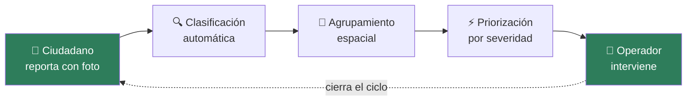
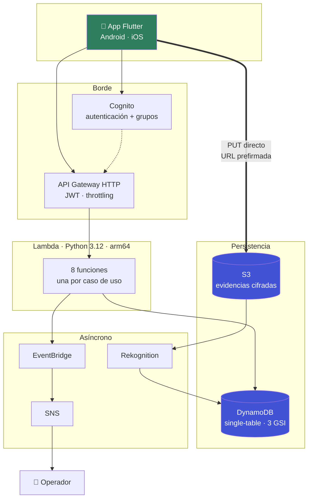

<div align="center">

# EcoRuta

**Aplicación móvil multiplataforma en Flutter para el reporte georreferenciado y la
priorización automática de puntos críticos de residuos sólidos urbanos**

Flutter · offline-first · backend serverless en AWS

[](https://github.com/DiegoGamba/ecoruta/actions/workflows/ci.yml)


</div>

---

## El problema

En las ciudades colombianas, parte de los residuos sólidos no llega al sistema formal de
recolección: se acumula en **puntos críticos** —esquinas, separadores, orillas de
quebrada— que aparecen, se erradican y reaparecen a media cuadra. Los inventarios que
levantan las entidades de aseo se desactualizan en semanas, y los canales de reporte
existentes producen texto libre sin coordenadas ni evidencia, lo que obliga a verificar
en campo antes de programar cualquier intervención.

Quien mejor detecta el problema —de forma inmediata y precisa— es el vecino que pasa por
ahí todos los días. **EcoRuta convierte ese conocimiento local en un inventario vivo y
priorizado.**

## La solución

Un ciudadano toma una foto, la app resuelve su ubicación y envía el reporte en menos de
un minuto, incluso sin conexión. En la nube, cada reporte se clasifica automáticamente
por tipo de residuo, se agrupa con los reportes vecinos en **puntos críticos** y se
prioriza por severidad acumulada. Los casos de residuos peligrosos alertan al operador
de aseo de inmediato.

<div align="center">



</div>

## Arquitectura



**Por qué serverless.** El tráfico es muy irregular: picos tras jornadas de limpieza o
lluvias, casi nulo de madrugada. Una arquitectura que escala a cero permite **desplegar
la demostración dentro de la capa gratuita de AWS** y operar una localidad completa por
unos 5 USD al mes, sin servidores que mantener. El razonamiento completo y las
alternativas descartadas están en los [ADR](docs/05-decisiones-adr.md).

| Componente | Servicio | Por qué |
|---|---|---|
| App móvil | Flutter 3.22 | Un código base para Android e iOS |
| Autenticación | Cognito (SRP, MFA opcional) | Cliente público sin secreto embebido; grupos en el JWT |
| API | API Gateway HTTP API | Valida el token en el borde, antes de invocar código propio |
| Cómputo | Lambda, Python 3.12, arm64 | Escala a cero; Graviton ≈20 % más barato |
| Datos | DynamoDB single-table | Toda consulta es un `Query`; nunca un `Scan` |
| Evidencias | S3 + URL prefirmada | La foto no atraviesa la capa de cómputo |
| Visión | Rekognition `DetectLabels` | Línea base sin dataset propio, reemplazable |
| Eventos | EventBridge + SNS + DLQ | El productor no conoce a sus consumidores |
| Infraestructura | Terraform 1.6 | Reproducible, revisable en un pull request |

## Lo que distingue este proyecto

- **Agrupamiento espacial propio.** Variante de DBSCAN sobre distancia de Haversine, con
  prefiltrado por geohash para que el análisis no escanee la ciudad entera. Convierte
  reportes sueltos en puntos críticos priorizados.
- **Geohash implementado desde cero** (sin dependencias), validado contra los vectores
  de referencia de la especificación.
- **Funciona sin conexión.** Los puntos críticos suelen estar donde peor llega la señal:
  si el envío falla, el reporte se persiste en el dispositivo y se reintenta solo.
- **Privacidad por diseño.** Seudonimización en logs, `user_id` fuera de toda respuesta,
  TTL de 540 días, cifrado en reposo extremo a extremo. Una prueba verifica que un error
  interno no filtre detalles al cliente.
- **Mínimo privilegio real.** Ocho roles IAM, uno por función, con permisos declarados
  explícitamente en un mapa de Terraform.
- **112 pruebas que corren sin AWS**, porque el dominio no conoce la nube.

> **Estado del proyecto.** La lógica de negocio funciona y se puede probar ahora mismo
> (ver abajo). La infraestructura Terraform está completa y validada en el pipeline, pero
> **aún no se ha aplicado a una cuenta de AWS**, y la app Flutter está escrita pero no
> compilada en un dispositivo. El detalle exacto está en [`ESTADO.md`](ESTADO.md).

## Probarlo en 30 segundos

Sin cuenta de AWS, sin credenciales y sin instalar nada — solo Python 3.12:

```bash
git clone https://github.com/DiegoGamba/ecoruta.git
cd ecoruta
python3 demo/local_server.py     # abrir http://localhost:8000
```


Arranca con 37 reportes sembrados en Bogotá y muestra los cinco puntos críticos que el
algoritmo detecta. Envíe tres reportes en un mismo lugar y verá aparecer un sexto: es el
umbral de tres reportes funcionando.

La demostración ejecuta **los handlers reales de las Lambdas** —la misma validación, el
mismo geohash, el mismo agrupamiento—; lo único sustituido es DynamoDB, por el
repositorio en memoria que usan las 112 pruebas. El detalle de qué es real y qué está
sustituido está en [`demo/README.md`](demo/README.md).

## Estructura del repositorio

```
ecoruta/
├── mobile/                 App Flutter (Android · iOS)
│   ├── lib/
│   │   ├── models/         Modelos de dominio
│   │   ├── services/       API, autenticación, ubicación, cola sin conexión
│   │   ├── screens/        Formulario de reporte y mapa de puntos críticos
│   │   └── theme.dart      Sistema visual accesible (Material 3)
│   └── test/               Pruebas de widget y de modelo
│
├── backend/                API en Python 3.12
│   ├── src/
│   │   ├── handlers/       8 Lambdas: adaptadores HTTP y de eventos
│   │   └── common/         Dominio, servicios, repositorios, utilidades
│   ├── tests/              112 pruebas (unitarias y de contrato)
│   └── api.http            Peticiones listas para reproducir el flujo
│
├── infra/                  Terraform: toda la infraestructura
│   ├── data.tf             DynamoDB + KMS
│   ├── storage.tf          S3 de evidencias + ciclo de vida
│   ├── auth.tf             Cognito
│   ├── compute.tf          Lambdas + roles IAM de mínimo privilegio
│   ├── api.tf              API Gateway + autorizador JWT
│   ├── events.tf           EventBridge + SNS + DLQ
│   └── monitoring.tf       Alarmas + tablero
│
├── demo/                   Demostración local ejecutable, sin AWS
│   ├── local_server.py     Handlers reales + repositorio en memoria
│   └── index.html          Mapa interactivo de puntos críticos
│
├── docs/                   Documentación técnica (13 documentos)
│   └── evidencias/         Capturas y salida de las pruebas
│
├── presentacion/           Presentación del proyecto (PDF)
└── .github/workflows/      CI y despliegue continuo
```

## Puesta en marcha

Requisitos: AWS CLI configurado, Terraform ≥ 1.6, Python 3.12, Flutter ≥ 3.22.

> **Costo.** Con los valores por defecto el despliegue de demostración cabe en la capa
> gratuita de AWS: `use_customer_managed_key` viene en `false` para evitar el único cargo
> fijo del diseño (1 USD/mes por clave KMS). `terraform destroy` lo elimina todo al
> terminar. Detalle en [Costo de operación](docs/02-arquitectura.md#27-costo-de-operación).

```bash
git clone https://github.com/DiegoGamba/ecoruta.git
cd ecoruta

# 1. Infraestructura
cd infra
cp terraform.tfvars.example terraform.tfvars
terraform init -backend-config="bucket=$TF_BUCKET" \
               -backend-config="key=ecoruta/dev/terraform.tfstate" \
               -backend-config="region=us-east-1"
terraform apply

# 2. App móvil, con la configuración que produce Terraform
cd ../mobile
flutter pub get
flutter run \
  --dart-define=API_BASE_URL=$(cd ../infra && terraform output -raw api_base_url) \
  --dart-define=COGNITO_USER_POOL_ID=$(cd ../infra && terraform output -raw cognito_user_pool_id) \
  --dart-define=COGNITO_CLIENT_ID=$(cd ../infra && terraform output -raw cognito_client_id)
```

La guía completa —estado remoto, creación del grupo de operadores, verificación y
solución de problemas— está en [docs/08-despliegue.md](docs/08-despliegue.md).

## API

| Método | Ruta | Grupo requerido | Descripción |
|---|---|---|---|
| `POST` | `/reportes` | — | Crear un reporte georreferenciado |
| `GET` | `/reportes/{id}` | — | Consultar el detalle |
| `PATCH` | `/reportes/{id}/estado` | `operadores` | Avanzar el ciclo operativo |
| `GET` | `/puntos-criticos` | — | Puntos críticos agrupados y priorizados |
| `GET` | `/indicadores` | `operadores` | KPIs de la operación |
| `POST` | `/evidencias/url` | — | URL prefirmada para subir la foto |

Contrato detallado con ejemplos: [docs/09-api.md](docs/09-api.md).

## Pruebas

```bash
cd backend && pytest --cov=src
```

```
112 passed in 0.49s
Cobertura total: 82 %  (dominio y servicios: 100 %)
```

Las pruebas corren sin credenciales de AWS y sin red, porque la lógica de negocio se
ejercita contra un repositorio en memoria con la misma semántica que DynamoDB. Detalle
de la estrategia, resultados del agrupamiento y limitaciones reconocidas en
[docs/06-pruebas-resultados.md](docs/06-pruebas-resultados.md).

## Documentación

| Documento | Contenido |
|---|---|
| [1 · Análisis del problema](docs/01-analisis-problema.md) | Situación, delimitación, objetivos, justificación tecnológica |
| [2 · Arquitectura](docs/02-arquitectura.md) | Diagramas, decisiones estructurales, algoritmo, costos |
| [3 · Modelo de datos](docs/03-modelo-datos.md) | Diseño single-table, índices, retención |
| [4 · Seguridad](docs/04-seguridad.md) | Modelo de amenazas, cifrado, privacidad, deuda reconocida |
| [5 · ADR](docs/05-decisiones-adr.md) | Ocho decisiones con contexto y consecuencias |
| [6 · Pruebas y resultados](docs/06-pruebas-resultados.md) | Estrategia, cobertura, hallazgos, limitaciones |
| [7 · Proyección investigativa](docs/07-proyeccion-investigativa.md) | Preguntas, metodología y productos esperados |
| [8 · Despliegue](docs/08-despliegue.md) | Guía paso a paso y solución de problemas |
| [9 · API](docs/09-api.md) | Referencia completa de los endpoints |
| [10 · Guion de sustentación](docs/10-guion-sustentacion.md) | Qué decir en cada diapositiva y banco de preguntas |
| [11 · Guion de video](docs/11-guion-video.md) | Guion cerrado para grabar la sustentación |
| [12 · Respuestas a la guía del taller](docs/12-guia-taller.md) | Cada campo de la guía de Canvas, respondido |
| [13 · Guion del video (5 min)](docs/13-guion-video-5min.md) | Guion cronometrado para la Entrega 2 |

## Presentación y sustentación

- [`presentacion/EcoRuta-presentacion.pdf`](presentacion/) — 14 diapositivas: problema,
  solución, arquitectura y resultados.
- [`presentacion/miniatura/`](presentacion/miniatura/) — miniatura 16:9 para el video.
- [`docs/13-guion-video-5min.md`](docs/13-guion-video-5min.md) — guion cronometrado.

## Proyección investigativa

El proyecto está diseñado para continuar como línea de investigación: validar los puntos
críticos derivados de reportes ciudadanos contra el inventario oficial, construir un
conjunto de datos abierto de residuos urbanos colombianos, y sustituir el clasificador
genérico por un modelo propio ejecutable en el dispositivo. El planteamiento completo
—preguntas, metodología, riesgos— está en
[docs/07-proyeccion-investigativa.md](docs/07-proyeccion-investigativa.md).

## Contexto académico

Taller ABP · Entrega 1 — **Diseño de Aplicaciones Móviles**
Facultad de Ingeniería, Ciencias y Administración.

## Licencia

[MIT](LICENSE)
