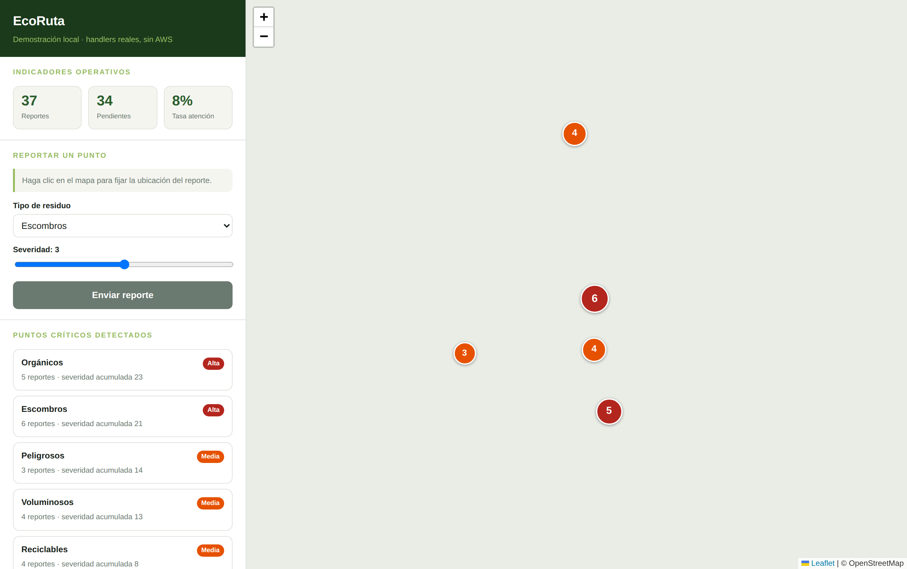

# Demostración local

Ejecuta la solución completa **sin cuenta de AWS, sin credenciales y sin instalar nada**.

```bash
python3 demo/local_server.py
```

Abrir <http://localhost:8000>.

Solo necesita **Python 3.9 o superior** (biblioteca estándar, sin dependencias). Para
detenerla, `Ctrl+C`.



## Qué es real y qué está sustituido

Esta es la parte importante, y conviene ser preciso al presentarla:

| Componente | En la demostración |
|---|---|
| Handlers de las Lambdas | **El mismo código** que se despliega en AWS |
| Validación de entrada | **Real** (`src/common/models.py`) |
| Geohash y distancia Haversine | **Real** (`src/common/geo.py`) |
| Agrupamiento en puntos críticos | **Real** (`cluster_reports`) |
| Transiciones de estado e indicadores | **Reales** (`src/common/services.py`) |
| Cabeceras de seguridad de las respuestas | **Reales** (`src/common/http.py`) |
| DynamoDB | Sustituido por `InMemoryReportRepository`, el mismo doble que usan las 112 pruebas |
| Autorizador JWT de Cognito | Sustituido por una identidad fija (`?operador=1` para el rol de operador) |
| S3, Rekognition, EventBridge, SNS | No participan: la demostración no sube fotografías |

Dicho de otra forma: **la lógica de negocio es la de producción; lo que cambia es de
dónde salen los datos y quién dice que usted es usted.** Los datos viven en memoria, así
que al detener el servidor desaparecen.

## Qué se puede mostrar

1. **Puntos críticos ya detectados.** Arranca con 37 reportes sembrados alrededor de
   Bogotá: cinco focos reales y doce reportes aislados. Los focos aparecen como círculos
   numerados; los aislados no aparecen, porque no alcanzan el umbral de tres reportes.
2. **El umbral en acción.** Haga clic en un punto vacío del mapa y envíe **un** reporte:
   no pasa nada. Envíe un segundo: tampoco. Al **tercero** aparece un punto crítico
   nuevo. Ese es el criterio que evita que una queja aislada movilice una cuadrilla.
3. **La priorización.** El color y el tamaño del marcador salen de la severidad
   acumulada del grupo, no del número de reportes.
4. **Un foco cerrado desaparece.** Los datos sembrados incluyen tres reportes ya marcados
   como `atendido`: no figuran entre los puntos críticos, porque el análisis solo
   considera lo que sigue abierto.
5. **La validación del servidor.** Con las herramientas de desarrollo del navegador, un
   `POST /reportes` con `severity: 99` devuelve `400` y el motivo exacto.

## Opciones

```bash
python3 demo/local_server.py --port 9000     # otro puerto
python3 demo/local_server.py --sin-datos     # arrancar con la base vacía
```

## Notas

- El mapa base viene de OpenStreetMap y necesita conexión a internet. Sin ella los
  puntos críticos se siguen dibujando sobre un fondo liso.
- Leaflet está incluido en `demo/vendor/`: la demostración no depende de una CDN.
- La autenticación está deshabilitada a propósito. **No exponga este servidor fuera de
  la máquina local.**

## Relación con el despliegue en AWS

Esta demostración **no reemplaza** el despliegue: sirve para mostrar y validar la lógica
de dominio sin infraestructura. El despliegue real está descrito en
[`docs/08-despliegue.md`](../docs/08-despliegue.md) y se ejecuta con `terraform apply`.
