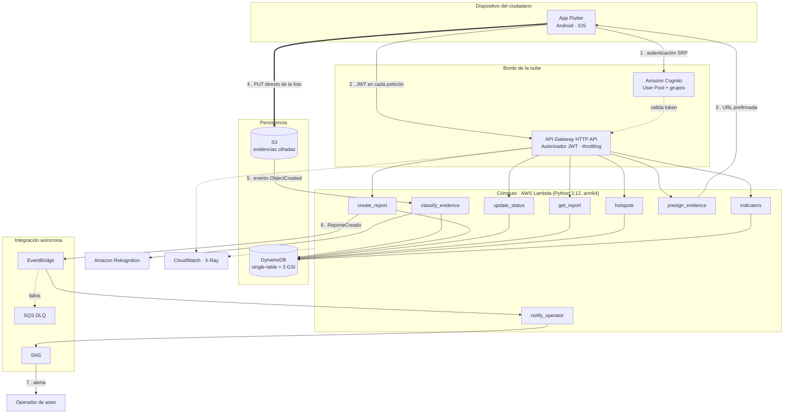
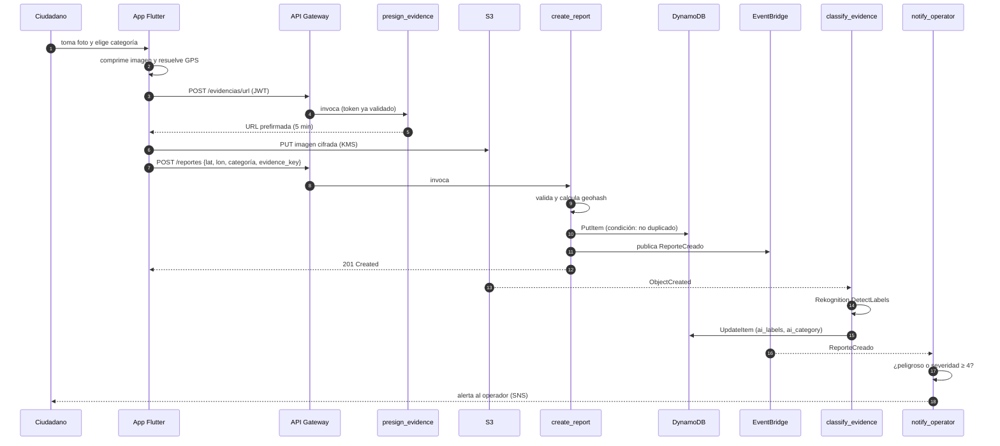
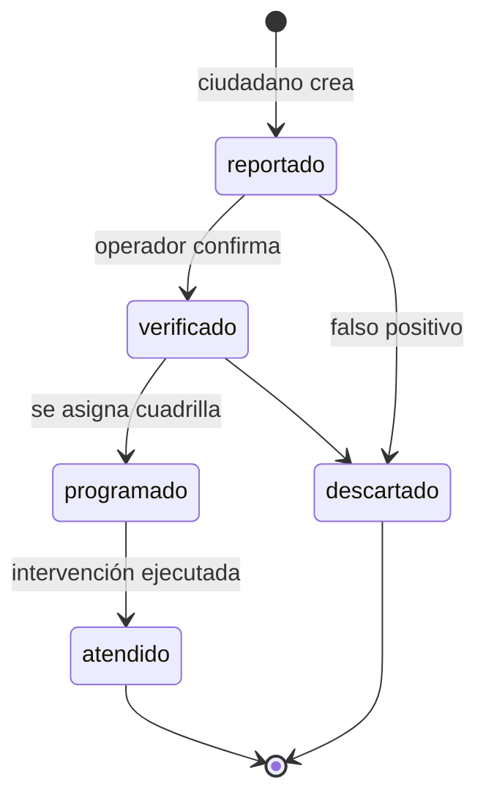

# 2. Arquitectura de la solución

## 2.1 Vista general



## 2.2 Decisiones estructurales

### Una función por caso de uso

Cada endpoint se despliega como una Lambda independiente en lugar de un monolito con
enrutamiento interno. El costo es más recursos que declarar; el beneficio, tres
propiedades que importan:

- **Permisos de mínimo privilegio reales.** `get_report` solo puede leer DynamoDB;
  `presign_evidence` solo puede firmar objetos en un prefijo del bucket y no toca la
  base de datos. Un monolito obligaría a unir todos los permisos en un rol.
- **Aislamiento de fallos.** Un error en la clasificación de imágenes no afecta la
  creación de reportes.
- **Métricas por endpoint sin instrumentación adicional.** Duración, errores y
  concurrencia llegan separados desde CloudWatch.

En el código, esto no duplica lógica: los handlers son adaptadores delgados sobre una
capa `services` compartida que no conoce HTTP ni AWS.

### Capas y dirección de dependencias

```
handlers/   adaptadores HTTP y de eventos  ─┐
                                             ├─► services/     casos de uso
common/http, config, logging  ──────────────┘        │
                                                      ▼
                                            repository/  (Protocol)
                                              ├── DynamoReportRepository
                                              └── InMemoryReportRepository  (pruebas)
                                                      │
                                            models/ + geo/   dominio puro
```

Las dependencias apuntan siempre hacia el dominio. Consecuencia práctica: las 92 pruebas
unitarias corren sin credenciales de AWS, sin red y en menos de un segundo, porque la
lógica de negocio se ejercita contra el repositorio en memoria.

### Modelo de datos: una sola tabla

Ver [modelo de datos](03-modelo-datos.md) para el detalle de claves e índices. La idea
central: cada consulta del producto se resuelve con un `Query` sobre una clave conocida,
nunca con un `Scan`. Los tres índices existen porque hay exactamente tres preguntas:
*¿qué hay cerca de aquí?* (GSI1, geohash), *¿qué está pendiente?* (GSI2, estado) y
*¿a qué reporte pertenece esta foto?* (GSI3, disperso sobre `evidence_key`).

### La foto no atraviesa el cómputo

`presign_evidence` devuelve una URL prefirmada y el dispositivo hace `PUT` directo a S3.
Esto evita el límite de 6 MB de payload de Lambda, elimina el costo de transferir la
imagen dos veces y reduce el tiempo de respuesta percibido. La URL vive 5 minutos, está
restringida a un tipo MIME de la lista blanca, a un tamaño máximo y a una clave que
incluye el hash del usuario, de modo que un enlace filtrado no permite escribir en
cualquier parte del bucket.

### Publicación de eventos en vez de llamadas directas

`create_report` no llama a la Lambda de notificación: publica `ReporteCreado` en
EventBridge. Añadir mañana un consumidor —un panel en tiempo real, una integración con
el sistema de rutas del operador, un pipeline de investigación— es agregar una regla,
sin tocar el código que ya funciona. Los eventos que fallan tras tres reintentos caen en
una DLQ con alarma, así que ningún reporte se pierde en silencio.

## 2.3 Flujo detallado del reporte



Nota sobre el orden: la app sube la foto **antes** de crear el reporte, de modo que
`evidence_key` ya existe cuando se persiste el registro. Si la clasificación llega antes
que el reporte (carrera posible), `classify_evidence` no encuentra el reporte en GSI3,
lo registra y no falla — el dato de IA es un enriquecimiento, no un requisito.

## 2.4 Algoritmo de agrupamiento

El endpoint `/puntos-criticos` convierte reportes sueltos en puntos críticos:

1. **Prefiltrado por geohash (GSI1).** Se consultan la celda del punto y sus vecinas a
   precisión 6 (≈ 1,2 km). Esto acota el conjunto a decenas de reportes sin escanear la
   tabla.
2. **Agrupamiento por densidad.** Variante de DBSCAN sobre distancia de Haversine: cada
   reporte no asignado abre un grupo y absorbe a los que estén dentro del radio
   (120 m por defecto, configurable entre 30 y 1000 m).
3. **Umbral de existencia.** Un grupo se considera punto crítico solo con 3 o más
   reportes. Evita que una queja aislada movilice una cuadrilla.
4. **Priorización.** Cada grupo recibe una severidad acumulada (suma de severidades
   declaradas) y se ordena de mayor a menor. La categoría dominante define el protocolo
   de manejo.

Solo entran al análisis los reportes en estado `reportado` o `verificado`: lo ya atendido
no debe seguir apareciendo como punto activo.

## 2.5 Estados del reporte



Las transiciones se validan en el servidor (`validate_status_transition`); no hay saltos
ni retrocesos. Un reporte no puede pasar de `reportado` a `atendido` sin verificación,
que es justamente el control que da confiabilidad al indicador de atención.

## 2.6 Atributos de calidad

| Atributo | Cómo se logra |
|---|---|
| **Escalabilidad** | Cómputo sin servidor con concurrencia automática; DynamoDB bajo demanda; sin cuello de botella compartido |
| **Disponibilidad** | Servicios administrados multi-AZ por defecto; ninguna instancia propia que mantener |
| **Seguridad** | JWT validado en el borde, IAM por función, cifrado KMS en reposo, TLS obligatorio, MFA opcional |
| **Observabilidad** | Logs JSON estructurados, trazas X-Ray, 11 alarmas, tablero operativo |
| **Mantenibilidad** | Capas con dependencias hacia el dominio, 92 pruebas, linting y análisis de seguridad en CI |
| **Costo** | Escala a cero; ARM64 (~20 % menos por invocación); ciclo de vida de S3 hacia clases frías |
| **Resiliencia** | Cola local en el dispositivo, reintentos con DLQ, escrituras idempotentes por condición |

## 2.7 Estimación de costos

Escenario piloto: una localidad, 3.000 reportes/mes, 30.000 consultas de mapa/mes,
foto promedio de 400 KB.

| Servicio | Consumo mensual | Costo estimado (USD) |
|---|---|---|
| Lambda | ~40.000 invocaciones, 512 MB, ~200 ms | 0,05 |
| API Gateway HTTP | ~40.000 peticiones | 0,04 |
| DynamoDB (bajo demanda) | ~50.000 lecturas + 6.000 escrituras | 0,10 |
| S3 | 1,2 GB acumulados + PUT | 0,05 |
| Rekognition | 3.000 imágenes | 3,00 |
| EventBridge, SNS, CloudWatch | volumen bajo | 0,60 |
| **Total aproximado** | | **≈ 3,85 USD/mes** |

El componente dominante es Rekognition, lo que refuerza la línea de investigación:
un clasificador propio, ligero y entrenado con imágenes locales reduciría ese costo
además de mejorar la pertinencia de las categorías al contexto colombiano.

---

Anterior: [Análisis del problema](01-analisis-problema.md) ·
Siguiente: [Modelo de datos](03-modelo-datos.md)
